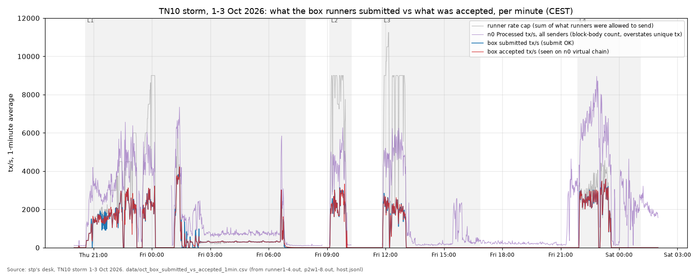
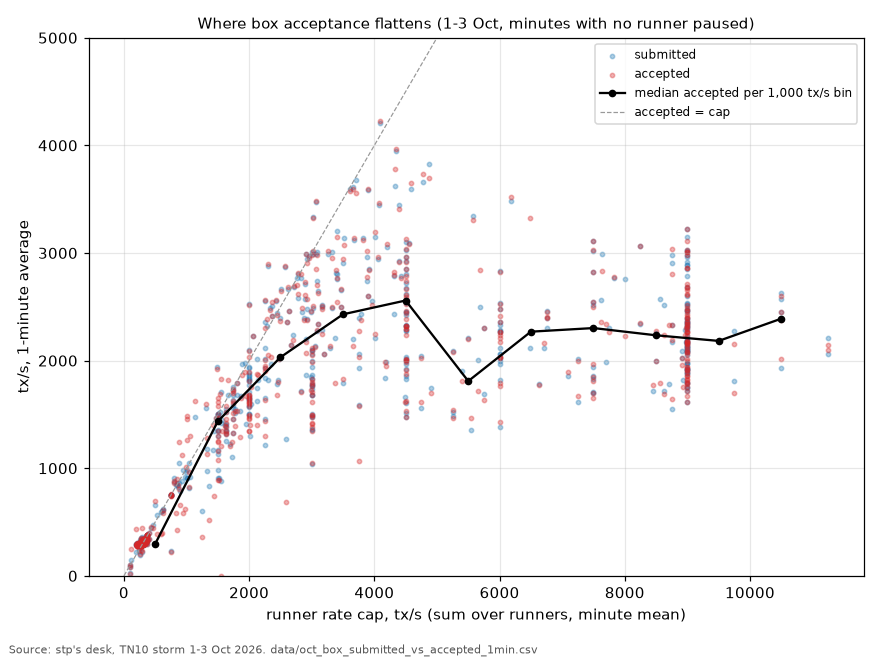
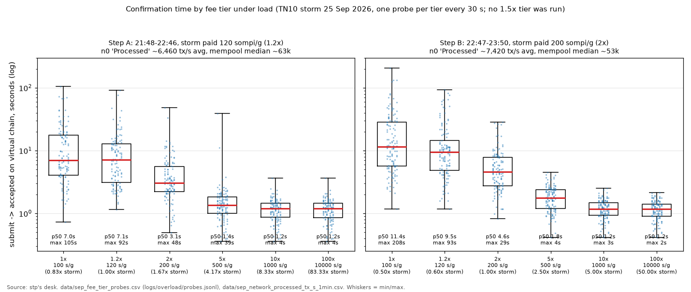
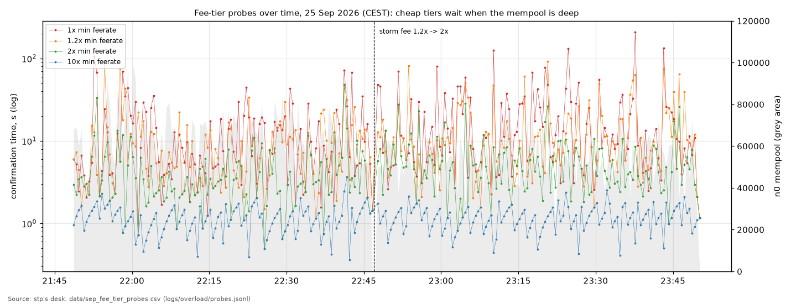
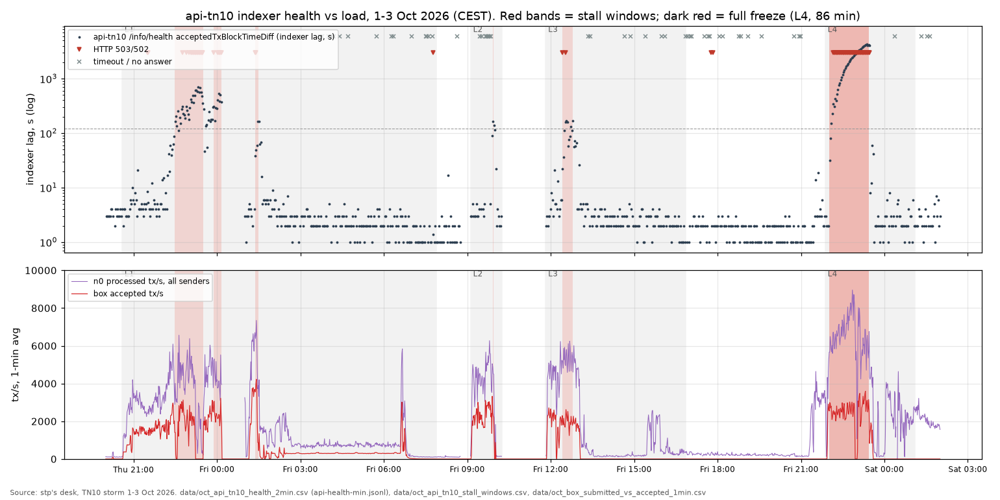
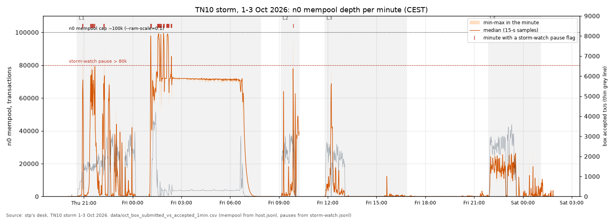

# TN10 storms: throughput, confirmation time, indexer and mempool — answers from our data

**Questions from Kaspa Pulse ([@gokugalax](https://x.com/gokugalax)). Thank you: these were the right questions to ask.**
The work and analysis in this repo were done by stp's desk (TN10 ops). Written Sun 4 Oct 2026, 23:00–23:59 CEST.

Kaspa **Testnet-10 (TN10) only**. Nothing here touched mainnet. All times are **CEST (UTC+2)**.
Every number names the file it came from. The CSVs in [`data/`](data/) are small extracts of our raw logs. The scripts in [`scripts/`](scripts/) rebuild those CSVs and every chart. Where something was **not logged**, this README says so.

## Labels used in this README

| Label | Meaning |
|---|---|
| **Claim (measured on TN10)** | We measured it on TN10. The number and its source file are given. It says nothing on its own about mainnet. |
| **Not sure / open for debate** | Reasonable, but we're not sure. The reason it might be wrong or might not carry over is given. |
| **Needs more testing** | We don't know. The test that would settle it is named. |

## Contents
- [Short answer](#short-answer)
- [Did our earlier storm repos already cover this?](#did-our-earlier-storm-repos-already-cover-this)
- [Q1. Accepted vs submitted tx/s over the whole storm](#q1-accepted-vs-submitted-txs-over-the-whole-storm)
- [Q2. Confirmation time per load step, normal fee vs 1.5×](#q2-confirmation-time-per-load-step-normal-fee-vs-15)
- [Q3. Does the indexer freeze?](#q3-does-the-indexer-freeze)
- [Q4. Mempool depth over time](#q4-mempool-depth-over-time)
- [How the TPS was reached](#how-the-tps-was-reached)
- [Could this TPS happen on mainnet?](#could-this-tps-happen-on-mainnet)
- [Next storm (target 13 Oct; possible early run 6 Oct if ready)](#next-storm-target-13-oct-possible-early-run-6-oct-if-ready)
- [Files](#files) · [Sources](#sources) · [Limits](#limits)

---

## Short answer

| # | Question | Status | In one line |
|---|---|---|---|
| 1 | Accepted vs submitted tx/s, where acceptance flattens | **Partly answered** | Logged per runner every 10 s. Our box's acceptance flattened at about **2,200–2,600 tx/s** (median per minute) once the runners were allowed more than ~3,000–4,000 tx/s. Best minute **4,253 tx/s**. Accepted stayed within 1% of submitted, because our sender throttles itself. What's missing is an open-loop offered rate and the other senders' submissions. |
| 2 | Confirmation time per load step, median and worst, 1× vs 1.5× fee | **Partly answered** | Measured per fee tier on 25 Sep at two load levels (1×, 1.2×, 2×, 5×, 10×, 100× the floor). **1.5× was not tested.** At ~6.5k "Processed" tx/s: 1× p50 **7.0 s** / max **105 s**; 2× p50 **3.1 s** / max **48 s**. The October storm logged latency at one fee per runner, with no A/B split. |
| 3 | Does the indexer freeze, at what tps, for how long | **Partly answered** | Yes. api-tn10 froze for **86 min** (Fri 2 Oct 22:01–23:27, lag up to **4,311 s**, HTTP 503) while our box sent **~2,435 tx/s** and n0 "Processed" **~6,546 tx/s**. Shorter stalls happened at lower loads. On 25 Sep it froze for **at least 3 d 15 h**. We have no load threshold and no cause. |
| 4 | Mempool depth over time | **Answered** | Sampled every 15 s for the whole storm. Peak **99,992** (Fri 2 Oct 01:35:47). A ~71k backlog sat for ~6 hours after our miners stopped. **486,140** evictions in L1. |

Kaspa Pulse is most interested in the 1× vs 1.5× fee question. The nearest thing we have is a 25 Sep probe at 1.2× (equal to the storm's own fee) and 2× (1.67× the storm's fee). Paying 1.67× the crowd's fee cut the median wait from **7.1 s to 3.1 s** and the worst case from **92 s to 48 s** ([Q2](#q2-confirmation-time-per-load-step-normal-fee-vs-15)). A real 1× vs 1.5× A/B split at each load step is the main item in the [next storm plan](#next-storm-target-13-oct-possible-early-run-6-oct-if-ready).

## Did our earlier storm repos already cover this?

"Storm 1" is the 25–26 Sep run. "Storm 2" is the 1–3 Oct run. "Build" is the Grok Build agent on stp's desk PC.

| Question | Storm 1 repos ([round1-public](https://github.com/STP-KAS/grok-bot-vprogs-round1-public), [round2](https://github.com/STP-KAS/grok-bot-vprogs-round2)) | Storm 2 ([public report](https://github.com/STP-KAS/tn10-storm-2026-10-public-report)) | Build ([build opinion](https://github.com/STP-KAS/tn10-vprogs-build-opinion), desk logs read in the public report) |
|---|---|---|---|
| 1. Accepted vs submitted | Network "Processed" tx/s and supervisor totals. No submitted vs accepted series over time | Leg totals and peaks (submitted 59,137,819 / included 58,905,910), and a 5-min included tx/s series (`data/box_5min.csv`). **No submitted vs accepted over time, no flattening view, no charts** | The desk sender logged **submit-OK**, not inclusion. Its local P2W meter counted virtual-chain inclusions, peak 2,795.6/min. No submitted vs accepted series |
| 2. Confirmation time by fee | **Yes, fee-tier probes** (1×–100×, 117 per tier), [`findings/overload-30m-summary.md`](https://github.com/STP-KAS/grok-bot-vprogs-round1-public/blob/main/findings/overload-30m-summary.md). First 57.5 min only. No 1.5× tier | Not covered | Not covered |
| 3. Indexer freeze | Not in these repos (the 25 Sep freeze is in a private working note, summarised in the storm 2 public repo) | **Yes**: stall windows, durations, box tps and n0 tps in each window (`data/api_windows_vs_load.csv`) | The build opinion notes the public health document stayed frozen. No timings of its own |
| 4. Mempool depth | Per-10-min medians/maxima in the overload summary | Per-window medians/p95/max and evictions (`data/mempool_windows.csv`). **No over-time chart** | Not covered |

So the pieces were mostly there, spread over several repos. This repo pulls them into one place, adds per-minute series and charts, and the second load step of the 25 Sep fee probes (22:47–23:50), which no earlier write-up had in full.

---

## Q1. Accepted vs submitted tx/s over the whole storm

**Status: partly answered.**

**What was logged.** Each box runner printed a report line every 10 s (`stress-tests/data/runner1-4.out`, `p2w1-8.out`) with cumulative counters:
- `submitted`: transactions the node accepted into its mempool (submit OK).
- `accepted`: our transactions whose id then appeared in n0's `virtual-chain-changed` notification, i.e. accepted by the selected chain. The engine code is `r5-engine.mjs` (class `Engine`).
- `rate`: the most that runner was allowed to send at that moment (its token-bucket cap).

[`scripts/extract.py`](scripts/extract.py) splits each runner's log into segments at restarts, spreads each 10-s increment evenly over its seconds and sums all runners per minute → [`data/oct_box_submitted_vs_accepted_1min.csv`](data/oct_box_submitted_vs_accepted_1min.csv) (1,801 minutes, Thu 1 Oct 20:00 → Sat 3 Oct 02:00). Check: the per-minute file sums to 59,149,806 submitted and 58,917,966 accepted. That matches the leg totals in [`data/oct_legs_from_public_report.csv`](data/oct_legs_from_public_report.csv) (59,137,819 / 58,905,910), except for a ~12k-tx smoke run before L1 (12,019 txs, Thu 20:14–20:16).

**What it shows**
- **Claim (measured on TN10):** **accepted tracked submitted closely in every leg**: L1 99.61%, L2 99.39%, L3 99.15%, L4 99.98% (`data/oct_legs_from_public_report.csv`). A transaction counts as "not accepted" when the runner that sent it never saw it on the chain. That includes transactions still in flight when a runner restarted, so the gap is not a count of dropped transactions.
- **Claim (measured on TN10):** **acceptance flattens.** Grouped by the runners' combined rate cap, minutes with no runner paused:

  | Rate cap (tx/s) | Minutes | Submitted, median | Accepted, median | Accepted, best minute | Mempool, median |
  |---|---:|---:|---:|---:|---:|
  | 0–999 | 311 | 297 | 297 | 1,244 | 71,528 |
  | 1,000–1,999 | 64 | 1,416 | 1,436 | 2,513 | 24,216 |
  | 2,000–2,999 | 76 | 2,017 | 2,031 | 2,988 | 19,040 |
  | 3,000–3,999 | 66 | 2,461 | 2,430 | 3,597 | 15,864 |
  | 4,000–4,999 | 52 | 2,492 | 2,559 | 4,227 | 3,191 |
  | 5,000–5,999 | 11 | 2,010 | 1,810 | 3,303 | 2,776 |
  | 6,000–6,999 | 23 | 2,266 | 2,269 | 3,518 | 3,445 |
  | 7,000–7,999 | 18 | 2,157 | 2,302 | 3,110 | 1,465 |
  | 8,000–8,999 | 21 | 2,227 | 2,235 | 3,063 | 2,811 |
  | 9,000–9,999 | 66 | 2,185 | 2,183 | 3,222 | 2,138 |

  (Computed from `data/oct_box_submitted_vs_accepted_1min.csv`. The 0–999 row is mostly the L1 night after our miners stopped, at ~300 tx/s with a ~71k backlog.) Up to a cap of about 3,000 tx/s, accepted rises with the cap. Above that, the median stays at about **2,200–2,600 tx/s**, however high the cap goes.
- **Claim (measured on TN10):** the knee test on Fri 2 Oct (L3): **6 runners 2,410 tx/s, 7 runners 2,383, 8 runners collapsed to 1,165**. At 8 runners the mempool went from 14k to 79k in 75 s and blocks were full by mass at 492k (public report README, L3 row; `build-brief-how-box-storm-works-2026-10-02.md` §7).
- **Claim (measured on TN10):** the best clock-aligned minute in our file is **4,227 accepted tx/s** (Fri 2 Oct 01:25). The best sliding 60 s is **4,252.8** (from 01:24:46), best 5 min **3,843**, best hour **2,517.6** (L4, from 21:57:12) (`data/oct_legs_from_public_report.csv`). Those peaks came with 7 runners, a 30× fee burst and our own miners making ~60% of blocks (see [How the TPS was reached](#how-the-tps-was-reached)).

**Why "partly":**
- **Submitted is not an open-loop offered rate.** A runner lane waits for each submit reply before building its next transaction, and runners pause themselves when the mempool is deep (>75k in the engine; storm-watch pauses everything at >80k). So when blocks are full, our sender slows down. The flattening shows up as **submit rate flattening** with acceptance following it, not as a growing gap between submitted and accepted. The rate cap is the best proxy for "offered" that we have.
- **Only our box's transactions.** The desk sender (Grok Build) logged submit-OK only. Other TN10 senders are unknown. n0's "Processed" counter (purple line) counts a transaction once for every block body that carries it, so it overstates unique transactions. On TN10 it ran about 1/3 high (round 7). Unique network-wide accepted tx/s per minute was not logged.
- **No stepped schedule.** The rate cap moved with the scaler, fee and guards, not in clean steps.

## Q2. Confirmation time per load step, normal fee vs 1.5×

**Status: partly answered.** "Confirmation" here means **submit → first acceptance on n0's selected chain** (not a depth of N blocks).

**What we have: fee-tier probes, 25 Sep 2026 (storm 1).** A probe script (`scripts/overload-probe.mjs` in [round1-public](https://github.com/STP-KAS/grok-bot-vprogs-round1-public)) sent one small self-transfer (mass 1,690) per fee tier every 30 s, and polled for its id among the chain's accepted transactions every 1 s. Fee tiers were multiples of the node's minimum relay feerate of 100 sompi/gram. Raw file: `tn10-break-test-2026-09-25/logs/overload/probes.jsonl` → [`data/sep_fee_tier_probes.csv`](data/sep_fee_tier_probes.csv) (one row per probe) and [`data/sep_fee_tier_summary.csv`](data/sep_fee_tier_summary.csv).

Two load levels ran back to back with the same probes. That gives two "load steps", though not a designed stepped schedule:

**Step A: 21:48:41–22:46:14.** The storm paid 120 sompi/g (1.2×). n0 "Processed" ~6,460 tx/s average ([`data/sep_network_processed_tx_s_1min.csv`](data/sep_network_processed_tx_s_1min.csv)). Mempool median ~63k, max 99,662.

| Tier | Feerate | vs storm fee | Probes | p50 | p90 | Worst | > 30 s |
|---|---:|---:|---:|---:|---:|---:|---:|
| 1× | 100 | 0.83× | 117 | **7.0 s** | 29.8 s | **105 s** | 11 |
| 1.2× | 120 | 1.00× | 117 | **7.1 s** | 21.8 s | **92 s** | 6 |
| 2× | 200 | 1.67× | 117 | **3.1 s** | 9.5 s | **48 s** | 2 |
| 5× | 500 | 4.17× | 117 | 1.35 s | 2.3 s | 39 s | 1 |
| 10× | 1,000 | 8.33× | 117 | 1.2 s | 1.7 s | 3.7 s | 0 |
| 100× | 10,000 | 83× | 117 | 1.2 s | 1.7 s | 3.7 s | 0 |

**Step B: 22:47:26–23:50:41.** The storm paid 200 sompi/g (2×). n0 "Processed" ~7,420 tx/s average (this includes the stop at the end). Mempool median ~53k, max 80,781.

| Tier | Feerate | vs storm fee | Probes | p50 | p90 | Worst | > 30 s |
|---|---:|---:|---:|---:|---:|---:|---:|
| 1× | 100 | 0.50× | 126 | **11.4 s** | 47.2 s | **208 s** | 28 |
| 1.2× | 120 | 0.60× | 126 | 9.5 s | 35.1 s | 93 s | 16 |
| 2× | 200 | 1.00× | 126 | **4.6 s** | 10.7 s | **29 s** | 0 |
| 5× | 500 | 2.50× | 126 | **1.8 s** | 2.8 s | **4.5 s** | 0 |
| 10× | 1,000 | 5.00× | 126 | 1.2 s | 1.8 s | 2.5 s | 0 |
| 100× | 10,000 | 50× | 126 | 1.2 s | 1.7 s | 2.1 s | 0 |

All 1,458 probes in the two steps were accepted. None was rejected or lost.

- **Claim (measured on TN10):** under load, **paying more bought faster inclusion**. Paying the same as the crowd gave a median of 4.6–7.1 s and a worst case of 29–92 s. Paying 1.67× the crowd (step A, 2× tier) roughly halved both. Paying 2.5× or more gave ~1–2 s medians and a worst case under 5 s (step B). 100× bought nothing over 10×.
- **Claim (measured on TN10):** **cheap transactions got worse when the load went up**. The 1× tier's median went from 7.0 s to 11.4 s and its worst case from 105 s to 208 s, as the storm's own fee moved further above it.
- **Not sure / open for debate:** whether **1.5×** behaves like our 1.2× or our 2× tier. It was not tested. 1.5× is between them, and our probes used the node's floor as "1×", not the node's "normal" estimate.
- **Not sure / open for debate:** these probes ran on one node with `--ram-scale=0.1` (mempool cap ~100k), under our own flood, with our miners making a large share of blocks, and with Grok Build's desk traffic possibly mixed in (round2 README, "Confounder").

**What the October storm logged.** The runners' `lat_p50` / `lat_p95` are **percentiles over every transaction that process saw accepted since it started**, not per 10-s interval (`r5-engine.mjs`, `pstats()` sorts the whole `lat` array). And each runner paid **one fee at a time**, so there was no 1× vs 1.5× split. The end-of-segment values are in [`data/oct_runner_latency_cumulative_by_segment.csv`](data/oct_runner_latency_cumulative_by_segment.csv), for example:
- L4 (Fri 21:57 → Sat 01:06, 200 sompi/g, ~2.5M txs per runner): p50 **6.0–7.1 s**, p95 **12.4–13.6 s**.
- L3 (Fri 11:52 → 16:50, 200–392 sompi/g, the six main runners): p50 **8.1–10.4 s**, p95 **16.4–20.7 s**.
- L1 night after our miners stopped (Fri 01:10 → 07:53; fee 6,000 → 200): p50 **~5 s** and p95 **893–953 s** for 6 of the 7 runners. The seventh shows p50 1.7 s / p95 101 s.

**Not logged in October: confirmation time per load step, and confirmation time by fee level.** We say this plainly. The next storm plan fixes both.

## Q3. Does the indexer freeze?

**Status: partly answered.** "Indexer" here is the public TN10 REST API **api-tn10.kaspa.org** (a kaspa-rest-server with its own database). It is not our node. We have no access to its logs.

**What was logged.** Every 120 s, `GET /info/health` → HTTP status and `acceptedTxBlockTimeDiff` (seconds the indexer's newest accepted transaction lags behind) (`stress-tests/data/api-health-min.jsonl` → [`data/oct_api_tn10_health_2min.csv`](data/oct_api_tn10_health_2min.csv), with our box's accepted tx/s and n0 "Processed" tx/s for the same minute). Stall windows come from the storm 2 public report: [`data/oct_api_tn10_stall_windows.csv`](data/oct_api_tn10_stall_windows.csv).

**Freezes and stalls, 1–3 Oct** (box tps and n0 tps are the averages inside each window):

| Window (CEST) | Length | What happened | Box accepted tx/s | n0 "Processed" tx/s | Back to normal |
|---|---:|---|---:|---:|---|
| Thu 22:29–23:31 | 62 min | lagging, not frozen: lag rose and fell between 137 and 704 s, intermittent 503 | 1,477 | 3,591 | Thu 23:33 |
| Thu 23:03–23:29 | 26 min | continuous 503 (inside the window above) | 951 | 2,705 | Thu 23:33 |
| Thu 23:53–Fri 00:09 | 16 min | stall + 503 again (our sampler then stopped for 51 min) | 2,421 | 4,217 | Fri 01:00 (our sampler was off 00:09–01:00) |
| Fri 01:22–01:30 | 8 min | 503 with slow (18 s) replies, then stall, during the 30× fee burst | 2,161 | 5,427 | Fri 01:32 |
| Fri 09:55–09:57 | 2 min | stall right after the L2 peak | 1,645 | 4,948 | Fri 09:59 |
| Fri 12:25–12:47 | 22 min | two 503s + intermittent stall, lag 22–170 s | 2,005 | 5,340 | Fri 12:49 |
| **Fri 22:01–23:27** | **86 min** | **full freeze**: 503 on every sample from 22:09 to 23:27; lag grew ~120 s per 120-s sample, max **4,311 s** at 23:21:49 | **2,435** | **6,546** | **Fri 23:29** |

- **Claim (measured on TN10):** **yes, it froze.** The longest freeze in the October storm was 86 minutes, while our box held ~2,435 accepted tx/s (best 5-min bin 3,238 at 23:15) and n0 "Processed" ~6,546 tx/s. Whenever our sampler was running, health came back within 2–4 minutes of the last bad sample.
- **Claim (measured on TN10):** **the chance of a bad health sample rose with n0's load** ([`data/oct_api_bad_samples_by_n0_processed_tps.csv`](data/oct_api_bad_samples_by_n0_processed_tps.csv)):

  | n0 "Processed" tx/s | Samples | Bad (non-200, timeout, or lag > 120 s) |
  |---|---:|---:|
  | 0–999 | 468 | 11% |
  | 1,000–2,999 | 138 | 10% |
  | 3,000–3,999 | 66 | 20% |
  | 4,000–4,999 | 63 | 38% |
  | 5,000–5,999 | 39 | 67% |
  | 6,000–6,999 | 28 | 79% |
  | 7,000+ | 15 | 100% |

  Samples inside one long freeze are not independent, and most 7,000+ minutes were inside the L4 freeze. Treat this as an association, not a threshold.
- **Claim (measured on TN10), storm 1:** on 25 Sep the indexer's accepted-transaction pointer froze at **21:55:38 CEST**, while our storm ran at about 6k "Processed" tx/s. It was still frozen (HTTP 503, lag 313,244 s ≈ 3 d 15 h) when we checked on 29 Sep at 12:56 CEST. We don't know when it recovered. Block ingestion kept going; only accepted-transaction processing was stuck. (Our private working note on that freeze; summarised in the storm 2 public repo, [`TN10-STORMS-MAINNET-IMPLICATIONS-2026-10-04.md`](https://github.com/STP-KAS/tn10-storm-2026-10-public-report/blob/main/TN10-STORMS-MAINNET-IMPLICATIONS-2026-10-04.md).)
- **Not sure / open for debate:** **cause.** Time correlation is not causation. The indexer is someone else's service. We don't know its hardware, its other users, or whether our own API calls mattered.
- **Needs more testing:** **"at what sustained tps does it freeze?"** We never held a fixed load long enough while watching it, and other stalls happened at loads where it was fine at other times. A stepped run with a 30-s health probe and a "can the indexer see my transaction yet" probe would settle it (see the plan).
- **Our own node did not freeze.** n0 stayed synced; sink age max 3.1 s in L1 (public report).

## Q4. Mempool depth over time

**Status: answered.**

**What was logged.** n0's `mempoolSize` every 15 s (`stress-tests/data/host.jsonl`). Storm-watch pause flags every 15 s (`stress-tests/data/storm-watch.jsonl`). Both are per minute (min / median / max) in [`data/oct_box_submitted_vs_accepted_1min.csv`](data/oct_box_submitted_vs_accepted_1min.csv). Per-window statistics and evictions from the storm 2 public report are in [`data/oct_mempool_windows_from_public_report.csv`](data/oct_mempool_windows_from_public_report.csv).

| Window | Median | p95 | Max | Evicted for higher feerate |
|---|---:|---:|---:|---:|
| L1, box miners on | 3,038 | 73,359 | 99,803 | 59,081 |
| L1, 30× fee burst Fri 01:10–01:30 | 64,992 | 75,560 | 77,480 | 0 |
| L1 night, box miners off | 71,498 | 84,142 | **99,992** | **427,059** |
| L2 | 2,176 | 59,180 | 96,293 | 0 |
| L3 loaded | 4,448 | 42,153 | 76,461 | 0 |
| L4 loaded | 17,140 | 25,993 | 30,826 | 0 |

- **Claim (measured on TN10):** peak **99,992** at Fri 2 Oct 01:35:47, just under n0's ~100k cap (`--ram-scale=0.1`). Storm-watch flagged a ">80k" pause in 50 of the 1,801 minutes.
- **Claim (measured on TN10):** **the backlog is the main story of the L1 night.** After our miners stopped at 01:31:50, a ~71k mempool sat for about six hours (02:00–07:30) while our inclusion fell to ~300 tx/s and blocks were only 11–26% full. Over that night n0 evicted 427,059 low-feerate transactions to make room for higher-feerate ones. L1 as a whole had **486,140** evictions.
- **Claim (measured on TN10):** in L4, at our highest sustained box rate (best hour 2,517.6 tx/s), the loaded mempool median was 17,140 and its max 30,826, with no evictions. The pace band (10k/20k) kept it well below the cap.
- What the mempool data does not tell us: who the other transactions belonged to, and which fee bands were waiting. The plan adds a 1-s sampler and a periodic fee-band snapshot.

---

## How the TPS was reached

### (a) How TN10 ops runs a storm (stp's box)

Sources: `build-brief-how-box-storm-works-2026-10-02.md` (written from the running code), `storm-p2w-runner.mjs`, `r5-engine.mjs`, `storm-watch.sh`, `timeline.md`, the storm 2 public report.

- **One node, one box.** All load went into **n0**, our own TN10 kaspad 2.1.0 on the box (8 vCPU Xeon VM, 16 GB RAM, 126 GB disk). It runs without a UTXO index, with `--ram-scale=0.1` (mempool cap ~100k). The miners, runners and samplers ran on the same box.
- **Workers ("runners").** A runner is one Node.js process with **1,250 lanes** (1,500 for runner 1) and **4 wRPC connections** to n0. A single connection tops out at ~378 tx/s. **6 runners** was the default. **7 was best overnight in L1** (3,845 tx/s at Fri 01:26 vs 3,375 with 6; `timeline.md`). In L3, 7 added nothing (2,383 vs 2,410) and 8 collapsed throughput to 1,165.
- **Lanes = independent coin chains.** Each lane holds exactly one coin. Its next transaction spends the previous one's output, with one transaction in flight per lane. The runner waits only for the node's "accepted into mempool" reply, not for a block, then builds the child. It tracks every lane's tip locally and never asks the node for UTXOs during the run.
- **Self-transfer transactions.** Each hop is **1 input → 1 output** back to the same lane address, no payload, no change. "P2W" lanes use an anyone-can-spend script tag (`push4(laneId) OP_DROP OP_TRUE`), so hops need no signature and weigh **643 grams** of mass. A signed 1-in-1-out weighs ~1,700 g, so P2W fits ~2.6× more transactions into a block. Early L1 also used signed "SMX" runners.
- **Coin feeder (UTXO prep).** A feeder (`coinbase-feeder.mjs`) hands each new lane one whole mature coinbase coin from our own mining address (median 3.087 tKAS). One funding transaction (1,701 g) per lane, no fan-out. A lane retires below 0.3 tKAS and re-funds.
- **Fee.** A fee daemon reads `getFeeEstimate` every 30 s and sets `feerate = min(FEE_MAX, max(2 × 100, 2 × clamp(normal, 100, 200)))`, i.e. **2× the normal estimate, with the base clamped so our own load can't run it up**, cap 400. Average paid feerate was **337–386 sompi/g in L2–L4** and **1,090 in L1** (`data/oct_legs_from_public_report.csv`). L1 includes a 30× period (up to 6,000 sompi/g) on the night of 1–2 Oct, which the build brief describes as a runaway from multiplying the raw estimate. The clamp was added after it. In storm 1 (25–26 Sep) the fee was 1.2×, then 2×, then **10× = 1,000 sompi/g** from 26 Sep 00:14 (storm 1 handoff log).
- **Mempool backoff.** A pace band slows every runner linearly as n0's mempool grows, from full rate at the low mark to zero at the high mark. The marks changed between legs: 45k/72k in L2; 25k/45k, then 10k/20k in L3; 10k/20k in L4 (`timeline.md`). Each runner also hard-pauses above 75k and resumes below 55k (`r5-engine.mjs`; the build brief describes a later 90k setting). Storm-watch pauses everything above 80k until it falls below 55k (`storm-watch.sh`).
- **Stop and disk/memory guards** (`storm-watch.sh`, `timeline.md`):
  - runner pause at free disk ≤ 21 GB (briefly 19.5 GB on 2 Oct);
  - STOP when free disk stays under **19 GB for more than 900 s** (pruning-window seconds don't count);
  - immediate STOP at 10 GB;
  - STOP when free RAM < 1 GB, or when n0 is unsynced or more than 300 s behind for 2 ticks;
  - rate cut to 25% in the pruning windows (07:05–08:10 and 19:05–20:10).
  
  The scaler drops the newest runner if the sink age exceeds 2.5 s. Every October leg ended on a disk pause or a disk or RAM STOP.
- **Our own miners.** stp's miners made **50–63% of TN10 blocks** while the box miners ran: L1 P2W 60.3%, L2 62.8%, L3 58.1% (`block_share_legs.csv` in the public report; L4 52.6% from the independent sampler there). When the box miners stopped (Fri 01:31:50), our inclusion fell to ~300 tx/s although blocks were mostly empty.
- **Block mass is the ceiling.** TN10 blocks fill by mass at ~490–500k per block. Past the knee, more senders only grow the mempool. At 8 runners, blocks hit 492k mass, the block rate fell from 9.1/s to 7.8/s, and throughput halved (build brief §7).

### (b) How Build generated its load (stp's desk PC)

Sources: our prompts to Build (`grok-build-tx-sender-2026-10-02.md`, `grok-build-prompt-v2-2026-10-02.md`, and the storm 2 "desk sender part 3" prompt), the desk check in the [storm 2 public report](https://github.com/STP-KAS/tn10-storm-2026-10-public-report#desk-check-later-the-same-day), [round2](https://github.com/STP-KAS/grok-bot-vprogs-round2) ("Confounder: Grok Build agent") and the [build opinion](https://github.com/STP-KAS/tn10-vprogs-build-opinion).

- **Machine:** Intel Core i7-13700K (16 cores / 24 threads), 32 GB DDR5, Windows 11 Pro, 1 Gbps Ethernet (from stp's screenshot; not checked by us). It also ran 20 CPU miners at about 75% CPU (stp's figure).
- **Wallet:** Build's own TN10 wallet, funded by us (299,993 tKAS on 25 Sep, round2; ~1.2M tKAS on 1–2 Oct, sender prompt).
- **What we asked it to run** (the prompts): 1-input → 1-output signed self-sends in chained lanes, sent to **public TN10 nodes** found through the Kaspa resolver, never to our n0.
  - First version: up to 400 lanes, at most 1,000 tx/s per process, fee 2× normal capped at 600 sompi/g.
  - v2: a coordinator plus auto-scaled workers, each with 4 connections and 250 lanes; flat 1.5× normal fee, cap 600; pause above 80k mempool.
- **What its logs show** (desk check in the public report):
  - a sender log with **17,415,510 submits** (Thu 20:38 → Fri 12:03). Its `accepted` field is a submit result, not inclusion.
  - a public-node runner whose status lines reached **24,249 submit-OK per second** (Fri 15:35:44, 24 workers). That is above any inclusion ceiling we measured, so it's a submit rate.
  - a "local P2W scale" path counting inclusions on the desk's own local node, peak **2,795.6/s** for a minute (Fri 21:33, feerate 150); 2,698.6 during L4.
  - An earlier public wallet-load note by Build: 1,162 tx/s, which was 340 sweeps in 0.29 s, all included (as read in the build opinion).
- **Unknown:**
  - which exact script versions ran on the desk;
  - how many desk transactions were included on chain (transaction ids were never matched to n0);
  - the desk's CPU/network limits;
  - how the local P2W path was set up beyond its log lines.
- **The "~4k tx/s combined" figure is stp's report, not our measurement.** Desk and box counts were never reconciled transaction by transaction. The public indexer was frozen during much of the overlap (L4).

## Could this TPS happen on mainnet?

No mainnet cost figures here. Kaspa Pulse asked us to leave mainnet congestion costing out, and we respect that.

| Statement | Label | Why |
|---|---|---|
| On TN10, one small box sending cheap 1-in-1-out transactions reached ~2,400 tx/s sustained and ~4,250 tx/s for a minute, with block mass as the limit | **Claim (measured on TN10)** | Q1; `data/oct_legs_from_public_report.csv` |
| The same consensus rules and block-mass limit apply on mainnet, so a block can't carry more of these transactions there than on TN10 | **Not sure / open for debate** | TN10 and mainnet share the rusty-kaspa consensus code, but block rate and parameters can differ between networks. We read no mainnet block-rate data in this repo |
| Our miners' share of blocks (50–63%) helped get our own transactions in. That isn't representative of a mainnet sender | **Claim (measured on TN10)** for the TN10 effect; **Not sure / open for debate** for mainnet | Inclusion fell to ~300 tx/s when our miners stopped, with blocks mostly empty. A mainnet sender would usually have no meaningful hashrate |
| Mainnet miners would include a flood like this at the same rate | **Needs more testing** | Never tested. Depends on miners' block templates and relay policy across many nodes |
| The 643-gram anyone-can-spend hop shape would work the same on mainnet | **Not sure / open for debate** | Mainnet relay policy may treat it the same, but anyone could take those coins. A real sender would use signed transactions (~1,700 g, ~2.6× fewer per block) |
| Paying more buys faster inclusion under load | **Claim (measured on TN10)** for our probes; **Needs more testing** for mainnet | Q2. On mainnet, fee competition comes from many independent senders and miners |
| A public mainnet indexer would freeze the way api-tn10 did | **Needs more testing** | Different operator, hardware and load. We have no data |
| Our node's limits (disk, pruning, RAM) would bind a mainnet node the same way | **Not sure / open for debate** | Those were our box's limits (126 GB disk, 16 GB RAM, `--ram-scale=0.1`), not protocol limits |

---

## Next storm (target 13 Oct; possible early run 6 Oct if ready)

Kaspa Pulse's full measurement set is targeted for the **13 Oct** storm. If the instrumentation is ready in time, an **optional early run on Tue 6 Oct (evening CEST)** will test it. Both use the same plan. Q4 is already answered; the plan still improves it.

### Q1: submitted vs accepted, where acceptance flattens
- **What:** per load step, (a) the offered rate (tokens granted), (b) submit-OK, (c) submit rejects by reason, (d) accepted on chain, counted both by submit time and by accept time, (e) seconds paused by each guard, and (f) **network-wide unique accepted tx/s**.
- **Why:** to tell "our sender slowed down" apart from "the network stopped accepting", and to replace the double-counting "Processed" meter.
- **How:**
  - extend each runner's 10-s report with `offered`, `submit_ok`, `reject_by_reason`, `accepted_by_submit_step`, `paused_s`;
  - a step file (`steps.jsonl`) marks each step's start and end;
  - extend the existing `virtual-chain-changed` logger to count **all** accepted transaction ids per notification. That gives unique network tx/s per 10 s, at almost no extra cost, since n0 already sends those notifications.
  - Mark a step "sender-limited" if submit-OK stays below 95% of its target.

### Q2: confirmation time per step, 1× vs 1.5×
- **What:** median, p95, p99 and worst submit → first-acceptance time, **per load step and per fee tier**, at **1× and 1.5×**. 1.2× and 2× probes too, for continuity with 25 Sep.
- **Why:** this is the question Kaspa Pulse cares about most, and we never ran it.
- **How:**
  - **Fee definition:** at the start of each step, read n0's `getFeeEstimate` normal feerate (floor 100 sompi/g) → F1. F1.5 = 1.5 × F1. Both are frozen for the whole step.
  - **A/B split across lanes:** in every runner, even-numbered lanes pay F1 and odd-numbered lanes pay F1.5. Same runner, same connections, same transaction shape (643 g), same moment. Lanes keep their tier for the step, so a chained child never waits behind a parent of the other tier.
  - **Independent probes:** a separate probe process sends one small, non-chained self-transfer per tier (1×, 1.2×, 1.5×, 2×) every 10 s from its own throwaway wallets (~90 probes per tier per 15-min step). These stand in for a normal user's transaction and avoid lane-chaining effects.
  - **Per-transaction timestamps:** `t_submit_start`, `t_submit_ok`, `t_accept` (when the `virtual-chain-changed` notification arrives), plus tier, step and lane.
    - Full per-transaction logs for a fixed 1-in-10 sample of lanes (both tiers), gzipped hourly.
    - Per-10-s, per-tier latency histograms (log buckets, 0.1 s to 30 min) for every transaction.
    - Per-interval percentiles replace today's cumulative `lat_p50`/`lat_p95`.
  - **Unaccepted transactions:** anything not accepted when the run stops is logged as "pending at stop", with its tier. No silent drops at restarts: runners are not restarted mid-step, and a restart is logged as such.

### Q3: indexer freeze, at what tps, how long
- **What:** indexer lag every 30 s, plus how long until the indexer can see one of our own known transactions, and at which step a freeze starts and ends.
- **Why:** to turn "it froze during heavy load" into "it froze after N minutes at X tx/s and recovered after Y minutes".
- **How:**
  - `GET https://api-tn10.kaspa.org/info/health?nc=<timestamp>` every 30 s. The query string bypasses Cloudflare's cache, which once served a stale "healthy" reply. Log the HTTP status, `acceptedTxBlockTimeDiff`, `blueScoreDiff` and `isSynced`.
  - Once a minute, take one 1× probe transaction that n0 has already accepted, and poll `GET /transactions/{txid}` every 5 s until it appears. Give up after 30 min and log "not visible". That's at most ~0.3 requests per second to api-tn10.
  - **Freeze rule:** 3 consecutive samples (90 s) with HTTP 503/timeout or a rising lag above 120 s. Report the step, the box's and the network's unique accepted tx/s, and the time to recovery.
  - A second public TN10 indexer is used only if we can confirm one exists. We won't name one we haven't checked.

### Q4: mempool depth (improvement)
- **What:** n0 mempool size every **1 s**, the fee estimate every 10 s, and our own pending transactions per tier.
- **How:** a dedicated sampler on n0's `getInfo` (local wRPC). Runners already poll the mempool once a second internally; that number is now logged.
  - Optional: a `getMempoolEntries` fee-band snapshot every 5 min, only while the mempool is below 50k, because it is heavy on a full pool.

### Load schedule and box limits
- **Workers:** 6 runners × 4 connections. A 7th runner only for the top step. Never 8; it collapsed throughput on 2 Oct.
- **Stepped schedule:**
  - 10 min baseline, probes only;
  - then steps of **500 → 1,000 → 1,500 → 2,000 → 2,500 → 3,000 tx/s → max (7 runners)**;
  - each step 15 min at a fixed target, followed by a 5-min pause with probes still running, to measure drain and recovery.
  - About 2 h 35 min in total, all fee and pace settings fixed within a step.
- **Keep the fee daemon off.** The A/B tiers above replace it during the steps. Our box miners' state stays fixed for the whole run and is logged. The desk (Build) sender stays off, or logs its transaction ids if stp wants it on.
- **Disk:** keep **~19 GB free for n0's pruning** at all times.
  - The morning pruning window (~07:15–08:30 CEST) needs 11–15 GB of temporary disk; the 3 Oct crash was a pruning disk-full. So start in the evening (~20:15, after the 19:05–20:10 window) and finish by ~01:00 CEST.
  - On 2 Oct, ~2.2k tx/s burned ~4.7–5.0 GB/h (`timeline.md`, 09:19). The schedule above should need roughly 10–12 GB *(estimate)*.
  - **Go only with ≥ 35 GB free at the start.** Otherwise shorten steps to 10 min.
  - Guards unchanged: runner pause ≤ 21 GB, STOP < 19 GB sustained > 900 s, immediate STOP at 10 GB, STOP at RAM < 1 GB.
- **Log budget:** per-transaction samples + histograms + 1-s mempool ≈ a few hundred MB gzipped *(estimate)*, written outside the n0 data directory and counted against the disk guard.

---

## Files

| Path | What |
|---|---|
| [`charts/1-submitted-vs-accepted-over-time.png`](charts/1-submitted-vs-accepted-over-time.png) | Q1: submitted vs accepted per minute, runner rate cap, n0 "Processed" |
| [`charts/1b-acceptance-flattening.png`](charts/1b-acceptance-flattening.png) | Q1: accepted vs rate cap, one dot per minute |
| [`charts/2-confirmation-time-by-fee-tier.png`](charts/2-confirmation-time-by-fee-tier.png) | Q2: confirmation-time distribution per fee tier, two load steps (25 Sep) |
| [`charts/2b-fee-tier-probes-over-time.png`](charts/2b-fee-tier-probes-over-time.png) | Q2: probe times over time with the mempool backlog (25 Sep) |
| [`charts/3-indexer-freeze-windows-vs-tps.png`](charts/3-indexer-freeze-windows-vs-tps.png) | Q3: api-tn10 lag and 503s, stall windows, box and n0 tx/s |
| [`charts/4-mempool-depth-over-time.png`](charts/4-mempool-depth-over-time.png) | Q4: n0 mempool per minute, pause flags |
| [`data/oct_box_submitted_vs_accepted_1min.csv`](data/oct_box_submitted_vs_accepted_1min.csv) | Per minute: rate cap, submitted, accepted, runners, mempool min/median/max, n0 Processed, disk, pause flags |
| [`data/oct_runner_latency_cumulative_by_segment.csv`](data/oct_runner_latency_cumulative_by_segment.csv) | Per runner segment: feerate, totals, cumulative p50/p95 |
| [`data/oct_api_tn10_health_2min.csv`](data/oct_api_tn10_health_2min.csv) | api-tn10 health samples with box and n0 tx/s |
| [`data/oct_api_tn10_stall_windows.csv`](data/oct_api_tn10_stall_windows.csv) | Stall windows (from the storm 2 public report) |
| [`data/oct_api_bad_samples_by_n0_processed_tps.csv`](data/oct_api_bad_samples_by_n0_processed_tps.csv) | Share of bad health samples by n0 load |
| [`data/oct_mempool_windows_from_public_report.csv`](data/oct_mempool_windows_from_public_report.csv) | Mempool statistics and evictions per window |
| [`data/oct_legs_from_public_report.csv`](data/oct_legs_from_public_report.csv) | Leg totals and peaks |
| [`data/sep_fee_tier_probes.csv`](data/sep_fee_tier_probes.csv) | 25 Sep: one row per fee-tier probe (no transaction ids) |
| [`data/sep_fee_tier_summary.csv`](data/sep_fee_tier_summary.csv) | 25 Sep: p50/p90/max per tier and step |
| [`data/sep_network_processed_tx_s_1min.csv`](data/sep_network_processed_tx_s_1min.csv) | 25 Sep: n0 "Processed" tx/s per minute (block-body count) |
| [`scripts/extract.py`](scripts/extract.py), [`scripts/charts.py`](scripts/charts.py) | Rebuild data/ from the raw logs, and charts/ from data/ (Python 3, matplotlib) |

## Sources

Raw logs stay on stp's box. They are large (the virtual-chain log alone is 54 MB) and contain transaction ids.
- **Storm 2, 1–3 Oct:**
  - `stress-tests/data/`: `runner1-4.out`, `p2w1-8.out` (runner reports), `host.jsonl` (mempool, n0 counters, disk), `storm-watch.jsonl` (guards), `api-health-min.jsonl` (api-tn10 health);
  - `stress-tests/run/timeline.md` (operator log);
  - `stress-tests/build-brief-how-box-storm-works-2026-10-02.md`, `storm-p2w-runner.mjs`, `storm-watch.sh`, `r5-engine.mjs` (code and how-to).
- **Storm 1, 25–26 Sep:** `tn10-break-test-2026-09-25/logs/overload/probes.jsonl`, `logs/tps12h/nettps.jsonl`, `logs/storm/ramp.log`, `HANDOFF.md`.
- **Public repos:** [tn10-storm-2026-10-public-report](https://github.com/STP-KAS/tn10-storm-2026-10-public-report), [grok-bot-vprogs-round1-public](https://github.com/STP-KAS/grok-bot-vprogs-round1-public), [grok-bot-vprogs-round2](https://github.com/STP-KAS/grok-bot-vprogs-round2), [tn10-vprogs-build-opinion](https://github.com/STP-KAS/tn10-vprogs-build-opinion).

## Limits
- One node (n0) on one small box, with a lowered mempool cap. Our own miners made a large share of blocks.
- "Accepted" is first acceptance on n0's selected chain, measured on the box clock. Not finality.
- n0's "Processed" counter double-counts transactions that sit in several parallel blocks.
- The box rate cap is a target, not a measured offered load.
- api-tn10 is a third-party service. We only see it from outside.
- Where a number above is an estimate rather than a measurement, it is marked *(estimate)*.
